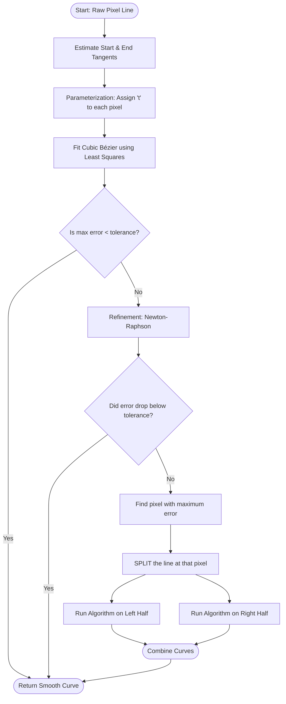
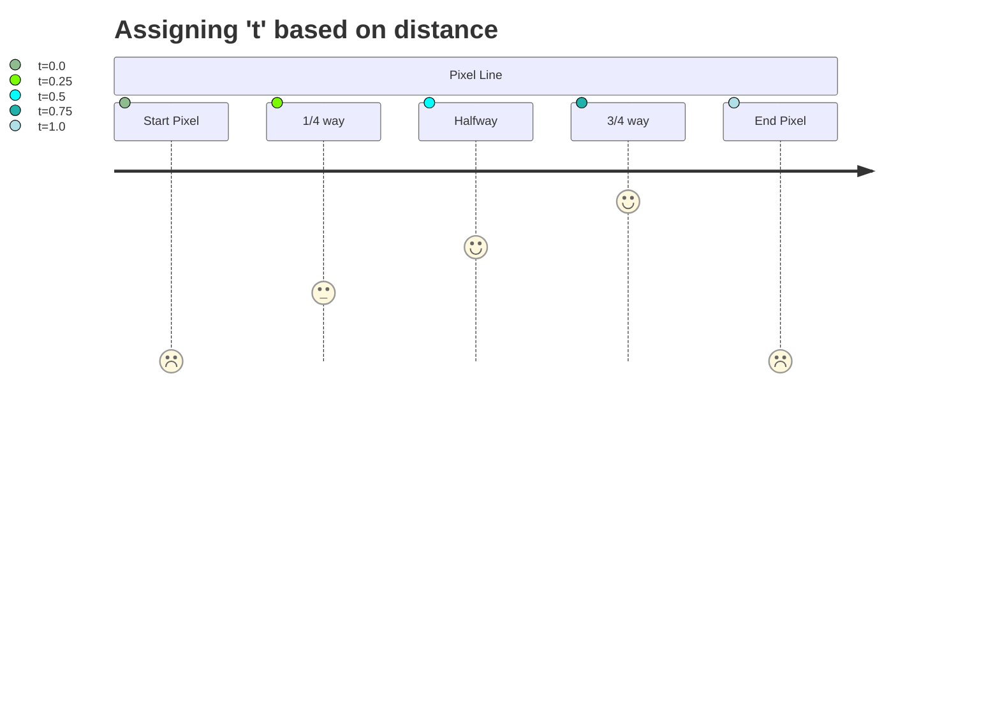
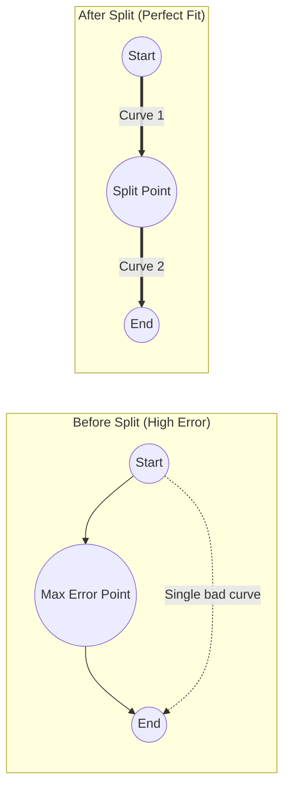

# Schneider's Bézier Fitting Algorithm

> **Reference:** Philip J. Schneider, "An Algorithm for Automatically Fitting Digitized Curves", *Graphics Gems I*, 1990.

This document provides a visual and technical breakdown of how the Sketch Restoration pipeline converts raw, jagged pixel lines (from skeletonization) into smooth, mathematical cubic Bézier curves.

---

## 1. The Core Concept: Why do we need it?

When you scan or process a damaged heritage sketch, the lines are made of individual pixels. Computers represent this as an array of `(x, y)` coordinates. 

However, raw pixels are terrible for structural analysis because they are jagged and discrete. We want **Bézier curves** because they are continuous, mathematically smooth, and defined by just 4 control points (`P0`, `P1`, `P2`, `P3`).

Schneider's algorithm bridges this gap: it finds the optimal 4 control points to make a Bézier curve perfectly hug a sequence of pixels.

---

## 2. Visual Flowchart of the Algorithm

The algorithm is **recursive**, meaning if it fails to fit a curve tightly enough, it will chop the line in half and try again on the smaller pieces.

---

## 3. Step-by-Step Breakdown

### Step 1: Initial Parameterization (Chord Length)
A Bézier curve is drawn over time `t` from `0` to `1`. To fit the curve to our pixels, we must assign a `t` value to every pixel. 
We do this based on distance. If a pixel is exactly halfway along the total length of the line, it gets `t = 0.5`.

### Step 2: Tangent Estimation
We look at the first few pixels and the last few pixels to determine the angle the line starts at, and the angle it ends at. 
These angles freeze the direction of our Bézier "handles" (`P1` and `P2`).

### Step 3: Least-Squares Fitting
Since we know the start point (`P0`), the end point (`P3`), and the directions of the handles, the only thing left to calculate is **how long the handles should be**. 
The algorithm uses linear algebra (Least-Squares) to calculate the exact handle lengths that minimize the distance between the generated curve and the actual pixels.

### Step 4: Error Evaluation
We measure the distance from every pixel to the nearest point on our new curve. 
- If the largest distance (Max Error) is less than our tolerance (e.g., 2.0 pixels), the curve is accepted.

### Step 5: Newton-Raphson Refinement
If the curve is slightly off, the initial guess for the `t` values in Step 1 might be to blame. The algorithm uses calculus (the Newton-Raphson method) to slightly nudge the `t` values left or right, and then runs Step 3 again to see if the fit improves.

### Step 6: Recursive Splitting
If the curve is completely wrong (e.g., trying to fit a single curve to an "S" shape), no amount of nudging will fix it. 
The algorithm finds the pixel with the absolute worst error, cuts the line in half at that exact pixel, and starts the whole process over for the two new halves.

---

## 4. Why is this used in Heritage Restoration?

1. **Noise Reduction:** Pixelated edges from damaged, ancient sketches have jagged artifacts. The fitting process naturally smooths out this pixel-level noise while retaining the macro-structure.
2. **Tangent Reliability:** By converting to Bézier curves, the pipeline can mathematically query the exact, continuous tangent angle at any endpoint. This is what allows Phase 2 (Candidate Generation) to accurately project lines across gaps to find connections.
3. **Data Compression:** A long, curved archway in a sketch might consist of 500 pixels. Schneider's algorithm compresses this into just 2 or 3 Bézier segments (8 to 12 data points), massively speeding up the ASP decision engine in Phase 4.
